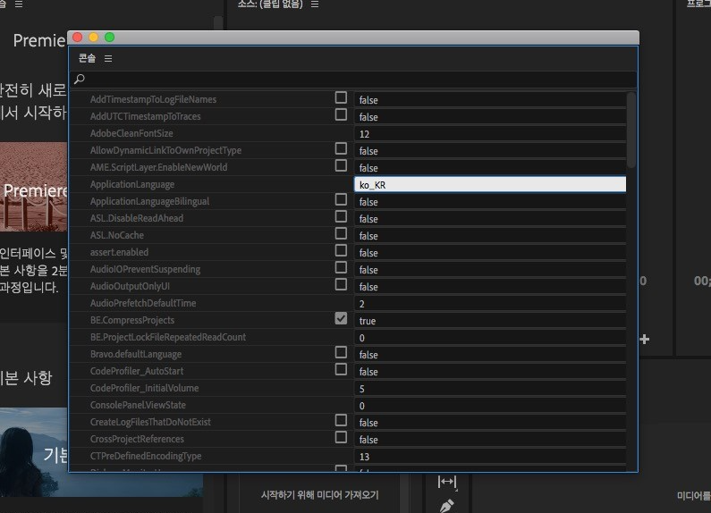

# adobe
adobe 제품군

## 설치방법(불법!)
- Creative_Cloud_Installer.dmg 설치
  ( 구글 연동으로 로그인/가입 )
- 프리미어 설치 (미디어인코더 자동으로 추가설치됨 )
- Adobe Creative Cloud 로그아웃
- Adobe Zii 6.1.0_TNT_AdobeZii.Com.dmg 설치
  (더블클릭, 'Adobe Zii 2021 6.1.0' 파일 -> Application(응용프로그램) 에 복사
- 'Adobe Zii 2021 6.1.0' 실행 -> 환경설정>보안에서 허용 -> PATCH 실행할것
 ** 현재기준 15.1 버전 설치가능

## 맥용 어도비 프리미어 CC 2020 영문판 <-> 한글판 바꾸는 방법

- 우선 프리머어 프로 (Premiere Pro) 프로그램을 실행
- 프로그램이 실행되면 command + f12 키를 누릅니다.

- 콘솔창이 나오면 콘솔 - > Debug Database View를 선택

- ApplicationLanguage 항목을 en_US <-> ko_KR 로 변경하고 프로그램을 종료후 재실행

